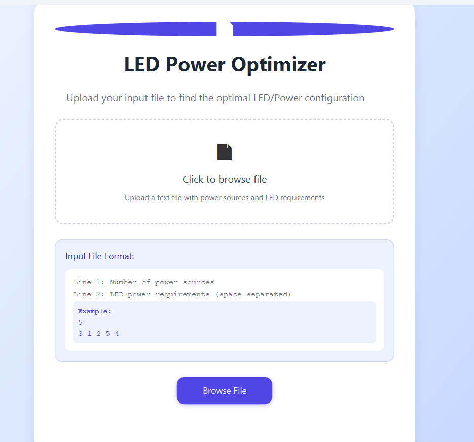
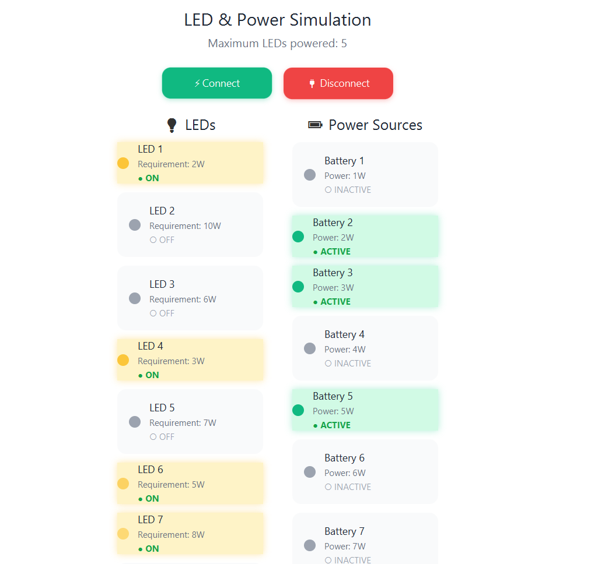
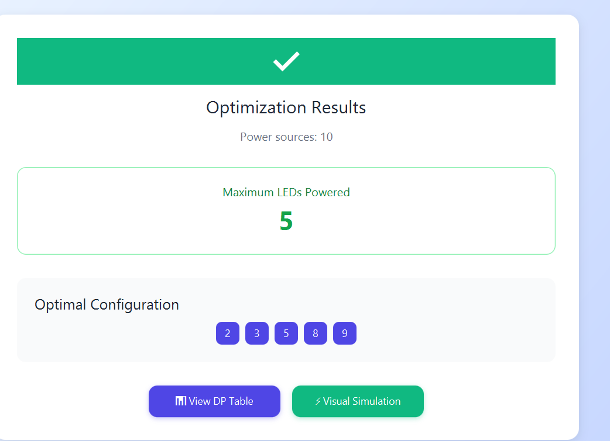
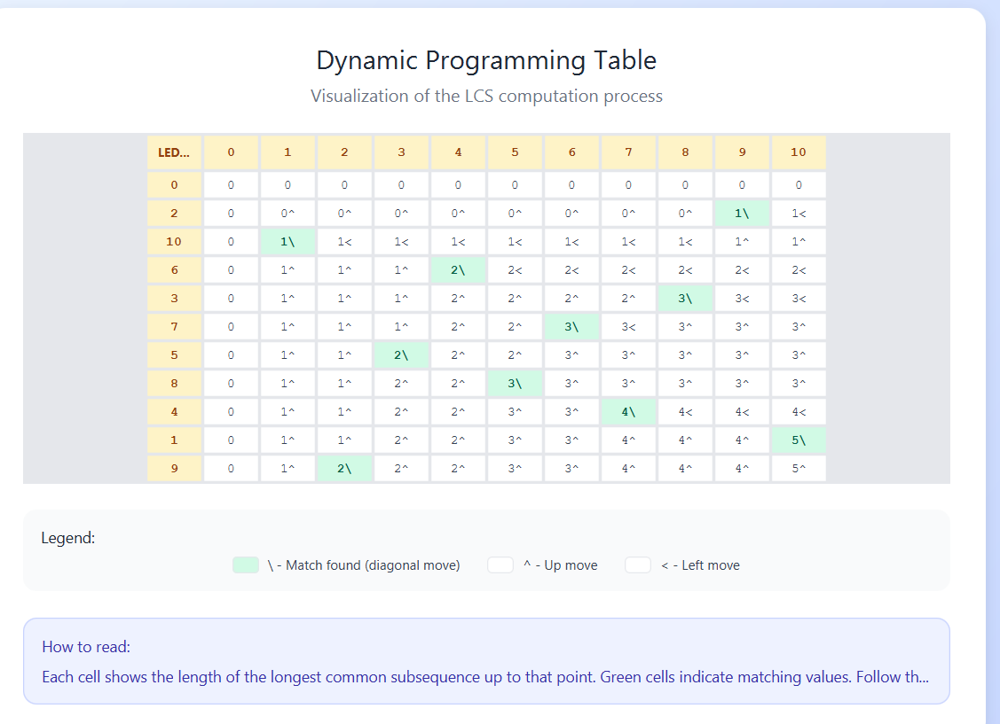

# 💡 LED Power Optimizer (Dynamic Programming & JavaFX)




This project is a **JavaFX-based LED Power Optimizer** that visualizes the connection between **LEDs and power sources** using **Dynamic Programming (Longest Common Subsequence – LCS)**.  
It calculates the *maximum number of LEDs that can be powered* and demonstrates the process via an interactive graphical interface.  

The repository contains **two versions**:  
1. **Original Version** – functional base implementation.  
2. **Styled Version** – enhanced UI with modern JavaFX styling for portfolio presentation.

---

## 📁 Repository Structure

```

LED-Power-Optimizer/
├─ Original-Version/
│  └─ src/
│     ├─ algorithmFirstProj/
│     │  └─ LCS.java
│     ├─ cont/
│     │  ├─ PowerLT10Control.java
│     │  ├─ PLT20Control.java
│     │  └─ TableControl.java
│     └─ pres/
│        ├─ OpeningScene.java
│        ├─ PB10to20Scene.java
│        └─ PLT102Scene.java
├─ Styled-Version/
│  └─ src/
│     ├─ cont/
│     │  └─ MainController.java
│     └─ pres/
│        ├─ ModernHomePage.java
│        ├─ ModernResultsPage.java
│        ├─ ModernSimulationPage.java
│        └─ ModernTablePage.java
├─ images/
│  ├─ off.png
│  ├─ on.png
│  ├─ offlamb.jpg
│  ├─ onlamb.jpg
│  ├─ table_view.png
│  ├─ summary_scene.png
│  └─ connection_scene.png
├─ data/
│  └─ input_example.txt
└─ README.md

```

---

## 🧮 Key Features

1. **Dynamic Programming Solution (LCS-based)**  
   * Computes maximum LEDs that can be powered.  
   * Shows optimal LED sequence and DP table.

2. **Interactive Visualization**  
   * Real-time LED and power source states.  
   * Buttons for `Connect`, `Disconnect`, and `Show Table`.

3. **Automatic Scene Selection**  
   * ≤10 power sources → detailed connection scene.  
   * 11–20 power sources → summary scene.

4. **Modern UI (Styled Version)**  
   * Gradient backgrounds, rounded buttons, hover effects, clean layout.

5. **Educational Insight**  
   * Displays DP table for debugging and learning purposes.

---

## 🖼️ Screenshots

| Scene | Description |
|-------|-------------|
| Opening Scene | File selection and start of simulation.  |
| LED Connection (≤10) | Interactive connections visualization.  |
| Summary Scene (10–20) | Optimal sequence summary.  |
| DP Table | Dynamic Programming table view.  |

---

## 📜 Example Output

```

You have 8 Power Sources
Maximum LEDs powered: 5
Optimal LED sequence: 2, 4, 7, 9, 11

````

---

## ⚙️ How to Run

1. Clone the repository:  

```bash
git clone https://github.com/abdallahabed/LED-Power-Optimizer.git
````

2. Open in **Eclipse**, **IntelliJ**, or **VS Code** with JavaFX support.
3. Run the main class (`OpeningScene.java` for Original-Version or `ModernHomePage.java` for Styled-Version).
4. Load an input file (e.g., `data/input_example.txt`).
5. Explore both **Original-Version** for functionality and **Styled-Version** for polished UI.

---

## 🧠 Algorithms & Concepts

* **LCS (Longest Common Subsequence)** – maximize LED-power connections.
* **2D Dynamic Programming Table (`C[i][j]`)** – stores intermediate results.
* **JavaFX Controls** – interactive UI with visual feedback.

---

## 🧑‍💻 Author

**Abdallah Aabed**
💻 [GitHub Profile](https://github.com/abdallahabed)

---

## 📄 License

MIT License – free to use, modify, and distribute.

---

✅ **Completed** – functional and styled UI with educational visualization.
